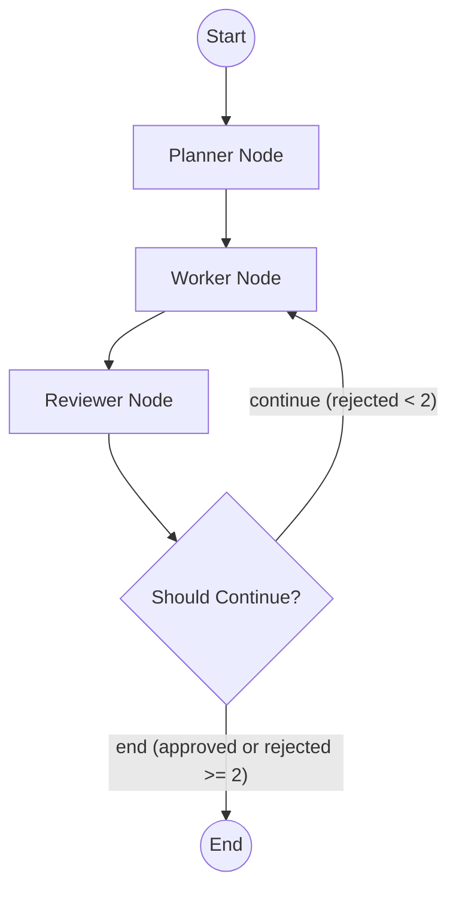

# Multi-Agent Workflow with LangGraph

## Problem Statement
Building autonomous agents that can plan, execute, and evaluate tasks requires a robust framework to handle state transitions and conditional logic (like re-working a task when it fails). Traditional linear pipelines are insufficient for complex tasks that require cyclical feedback loops.

## Objective
To build a multi-agent workflow using LangGraph that splits a task across specialized agents (Planner, Worker, Reviewer). The workflow must explicitly manage state and include a conditional edge where a Reviewer can send work back to the Worker if it doesn't meet the standards.

## Approach / Architecture
We model the workflow as a state machine using LangGraph. The `AgentState` holds the current task, plan, draft, feedback, and a `rejection_count`. 

The core nodes are:
1. **Planner**: Creates a step-by-step plan based on the task.
2. **Worker**: Generates a draft, incorporating any previous feedback from the reviewer.
3. **Reviewer**: Evaluates the draft. If it fails, it sends feedback back to the worker.

### Architecture Diagram


### Failure Mode: Reviewer Rejects Twice
When the reviewer rejects a draft, the `rejection_count` in the state is incremented. The conditional edge logic inspects this count:
- **First Rejection (`rejection_count` = 1):** The conditional edge routes back to the `Worker` to revise the draft based on the new feedback.
- **Second Rejection (`rejection_count` = 2):** To prevent infinite loops of poor performance, the workflow acts defensively. When the `rejection_count` reaches 2, the conditional edge routes to `END`, halting the workflow even if the draft wasn't approved. 

## Technologies Used
- Python 3.10+
- **LangGraph**: For orchestrating the cyclical graph and managing explicit state.
- **LangChain Core**: Base framework for building agent tools and prompts.

## Installation & Setup
1. Clone the repository.
2. Create a virtual environment:
   ```bash
   python -m venv venv
   source venv/bin/activate  # On Windows: venv\Scripts\activate
   ```
3. Install dependencies:
   ```bash
   pip install -r requirements.txt
   ```

## How to Run
Execute the main workflow script:
```bash
python -m src.main
```
To run the automated tests verifying the graph logic and conditional routing:
```bash
PYTHONPATH=. pytest tests/
```

## Results / Evaluation
The workflow successfully demonstrates cyclical agent interactions. The graph output shows the state flowing from planner to worker to reviewer, looping back for revisions, and ultimately succeeding or halting after reaching the rejection threshold.

## Screenshots / Demo

```text
Starting Multi-Agent Workflow...

--- PLANNER ---
--- Finished node: planner ---
--- WORKER ---
--- Finished node: worker ---
--- REVIEWER ---
Reviewer decision: REJECTED. Feedback: The draft provides a very generic overview of AI Agents without delving into any specific examples, case studies, or in-depth analysis. It lacks depth and original insights that would make it engaging for readers interested in the topic. Please revise the content to include more specific examples, real-world applications, and critical analysis to make it more informative and compelling.
--- Finished node: reviewer ---
--- WORKER ---
--- Finished node: worker ---
--- REVIEWER ---
Reviewer decision: REJECTED. Feedback: The draft lacks a clear structure and fails to provide a cohesive narrative about AI Agents. The content is too general and lacks depth, with superficial examples that do not fully illustrate the impact of AI Agents in different industries. Additionally, the conclusion is weak and does not effectively summarize the key points discussed. Please revise the draft to include more specific examples, address potential challenges in a more detailed manner, and provide a stronger conclusion that ties back to the introduction.
MAX REJECTIONS REACHED. Stopping workflow.
--- Finished node: reviewer ---

Workflow Completed!
```

## Key Learnings
- Explicitly defining state using `TypedDict` and reducing functions (like `operator.add` for the rejection counter) is extremely powerful for predictable agent behavior.
- LangGraph's conditional edges provide fine-grained control over workflow loops, preventing infinite cycles via state-based rules.

## Future Improvements
- Integrate actual LLM calls (e.g., via `langchain-openai`) to dynamically generate plans, drafts, and reviews.
- Add an explicit `Failure` node to handle the "rejected twice" scenario, perhaps notifying a human-in-the-loop.
- Build a Streamlit or Gradio UI to visualize the agent interactions in real-time.
